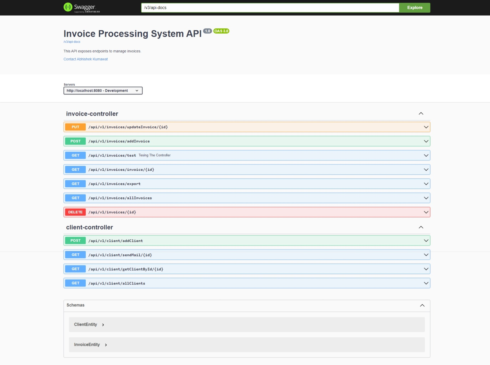

# Invoice-Processing-System
It is a powerful and efficient invoice processing system designed to streamline client and invoice management for businesses. With a focus on simplicity and functionality, It enables administrators to manage clients and invoices effortlessly, send notifications, and export data for reporting and analysis.

## About Invoice Processing System

It is built to assist administrators in managing client invoices with ease. It offers a range of features including client management, invoice creation and tracking, email notifications, and data export capabilities. Whether you're handling simple transactions or managing monthly installments, It is designed to make the process smooth and hassle-free.

## Features

### Client Management

- **Add Clients**: Easily add new clients to the system with their contact details.
- **Update Clients**: Modify existing client information as needed.
- **Delete Clients**: Remove clients from the system when they are no longer active.

### Invoice Management

- **Create Invoices**: Generate new invoices with details such as name, creation date, due date, paid status, paid date, client email, and client mobile number.
- **View Invoices**: Access detailed information about all invoices.
- **Update Invoices**: Make changes to existing invoices as required.
- **Delete Invoices**: Remove invoices that are no longer needed.
- **Send Email Notifications**: Notify clients about their invoices via email, ensuring timely communication and follow-up.
- **Export to CSV**: Export invoice data to CSV files for reporting and archival purposes.

### Real-World Use Case

Imagine a scenario where a client purchases a car from a showroom, paying half the price upfront. The admin can create an invoice for the initial payment and set up monthly installments. Each month, the admin can update the invoice to reflect the payments made, notify the client about the due amount via email, and export the invoice data for record-keeping.

## Technologies Used

- Java
- Spring Boot
- Java Mail
- Spring Boot Dev Tools
- Hibernate
- H2 Database
- MySQL
- Maven
- Model Mapper
- Eclipse IDE

## Swagger UI

